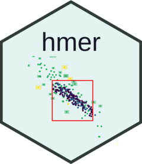

<!-- README.md is generated from README.Rmd. Please edit that file -->

# hmer 

<!-- badges: start -->

[](https://github.com/andy-iskauskas/hmer/actions/workflows/R-CMD-check.yaml)
[](https://CRAN.R-project.org/package=hmer)
[](https://app.codecov.io/gh/andy-iskauskas/hmer?branch=master)
[](https://cran.r-project.org/package=hmer)
[](https://cran.r-project.org/package=hmer)
<!-- badges: end -->

## Overview

The goal of hmer is to make the process of history matching and
emulation accessible and easily usable by modellers, particularly in
epidemiology. The central object of the process is an `Emulator`: a
statistical approximation for the output of a complex (and often
expensive) model that, given a relatively small number of model
evaluations, can give predictions of the model output at unseen points
with the appropriate uncertainty built-in. Using these we may follow a
process of ‘history matching’, where unfeasible parts of the parameter
space are ruled out. Sampling parameter sets from the remaining region
allows us to train more accurate emulators, which allow us to remove
more of the space, and so on. The hmer package contains tools for the
automated construction of emulators, visualisations for diagnostic
checks and exploration of parameter space, and a means by which new
points can be proposed.

## Installation

You can install the development version of hmer from
[GitHub](https://github.com/) with:

``` r
# install.packages("devtools")
devtools::install_github("andy-iskauskas/hmer")
```

## Example

The three core functions of the package are called below, using built-in
toy data.

``` r
library(hmer)
#> Registered S3 method overwritten by 'GGally':
#>   method from   
#>   +.gg   ggplot2
## Train a set of emulators to data
ems <- emulator_from_data(input_data = SIRSample$training,
                          output_names = names(SIREmulators$targets),
                          ranges = list(aSI = c(0.1, 0.8), aIR = c(0, 0.5), aSR = c(0, 0.05)))
## Perform diagnostics on the emulators
validation <- validation_diagnostics(ems, SIREmulators$targets, SIRSample$validation, plt = FALSE)
## Propose new points from the emulators
new_points <- generate_new_design(ems, 50, SIREmulators$targets)
```

## Learning Emulation and History Matching

There is a wealth of published information on Bayes Linear emulation,
history matching, and the more general framework of uncertainty
quantification, upon which this package is based. The easiest way to
learn how to use the hmer package, however, is to look through the
vignettes within.

``` r
browseVignettes("hmer")
vignette("low-dimensional-examples", package = 'hmer')
```

- Low-dimensional examples `low-dimensional-examples` introduces the
  basics of emulation and history matching and how to use `hmer` in some
  low-dimensional toy models;

- Demonstration `demonstrating-the-hmer-package` serves as a broad
  overview of most of the functions in the package;

- Stochastic and Bimodal Emulation `stochasticandbimodalemulation`
  introduces the basics of dealing with stochastic systems, and
  identifying bimodality;

- The “Emulation Handbook” `emulationhandbook` details some common
  problems and considerations that occur when using the framework, and
  serves as a broad FAQ for problems encountered.
