```r
library(hmer)
library(ggplot2)
set.seed(1)
```

# Introducing hmer
This vignette briefly outlines the main functionality of the `hmer` package. It can be seen as a quick reference to the main functions and usage of the package and will not detail the mathematical framework of emulation and history matching: for a more in-depth treatment, see the other vignettes in the package.

We use a set of (included) model run datasets to demonstrate the functionality - all have been generated from an SIRS model using a system of differential equations. The stochastic equivalent (using the Gillespie algorithm) will be dealt with in a later vignette.

## Training emulators
The first step, given a dataset (here the `SIRSample` training set), is to train an emulator to each output. We need to provide details about the parameters (and their ranges) to the model and the outputs from the model, as well as the data itself. Then the function `emulator_from_data(data, outputs, ranges, ...)` produces a set of `Emulator` objects, as a named list.


```r
input_ranges <- list(aSI = c(0.1, 0.8), aIR = c(0, 0.5), aSR = c(0, 0.05))
output_names <- c('nS', 'nI', 'nR')
wave1_emulators <- emulator_from_data(SIRSample$training, output_names, input_ranges)
#> Fitting regression surfaces...
#> Building correlation structures...
#> Creating emulators...
#> Performing Bayes linear adjustment...
```

An emulator is an R6 object, with the requisite print statement giving the core details of the emulator. It also contains a Correlator object with similar R6 properties.


```r
wave1_emulators$nS
#> Parameters and ranges:  aSI: c(0.1, 0.8): aIR: c(0, 0.5): aSR: c(0, 0.05) 
#> Specifications: 
#> 	 Basis functions:  (Intercept); aSI; aIR; aSI:aIR 
#> 	 Active variables aSI; aIR 
#> 	 Regression Surface Expectation:  572.2885; -412.1201; 249.8202; 113.7759 
#> 	 Regression surface Variance (eigenvalues):  0; 0; 0; 0 
#> Correlation Structure: 
#> Bayes-adjusted emulator - prior specifications listed. 
#> 	 Variance (Representative):  6472.576 
#> 	 Expectation:  0 
#> 	 Correlation type: exp_sq 
#> 	 Hyperparameters:  theta: 0.9033 
#> 	 Nugget term: 0.05 
#> Mixed covariance:  0 0 0 0
wave1_emulators$nS$corr
#>  Correlation type: exp_sq 
#>  Hyperparameters:  theta: 0.9033 
#>  Nugget term: 0.05
```

The default training process assumes the following:

- The correlation structure is exponential-squared;
- The regression surface is no more than quadratic in the inputs;
- The specifics of regression parameters, correlation length, and overall variance is to be determined during the training process;
- The output emulators are trained using Bayes Linear adjustment before being outputted.

Any of these default behaviours can be modified; for instance, manually setting the correlation lengths requires the provision of a numeric vector of correlation lengths:


```r
custom_emulators <- emulator_from_data(SIRSample$training, output_names, input_ranges, c_lengths = c(0.6, 0.7, 0.85))
#> Fitting regression surfaces...
#> Building correlation structures...
#> Creating emulators...
#> Performing Bayes linear adjustment...
custom_emulators$nR$corr
#>  Correlation type: exp_sq 
#>  Hyperparameters:  theta: 0.85 
#>  Nugget term: 0.05
```

One could instead specify a different correlation function, for instance Matérn:


```r
matern_emulators <- emulator_from_data(SIRSample$training, output_names, input_ranges, corr_name = "matern")
#> Fitting regression surfaces...
#> Building correlation structures...
#> Creating emulators...
#> Performing Bayes linear adjustment...
```

In any event, having trained emulators it is crucial to ensure that they are accurately representing the model behaviour, at the very least over the region of potential interest. The `validation_diagnostics` function produces some simple plots to check this. It requires a separate hold-out or validation set of model runs. Some of the diagnostic functions also require a set of targets - values which we expect the model to match to. These can be specified as a named list, each element consisting of an observation value `val` and an associated uncertainty `sigma`; alternatively we can provide an upper and lower bound $[a,b]$ corresponding to the target range. A combination thereof can be provided in a given set of targets.


```r
targets <- list(
  nS = c(580, 651),
  nI = list(val = 169, sigma = 8.45),
  nR = c(199, 221)
)
```


```r
invalid_points <- validation_diagnostics(wave1_emulators, targets, SIRSample$validation, plt = TRUE)
```

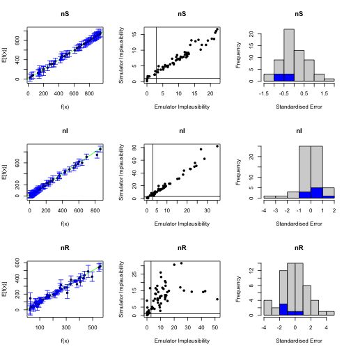

## Visualising Emulator Behaviour

Emulators can be used as a (statistical) surrogate for the model, and in particular can be used to investigate parameter behaviour across the space. The main function for doing so here is `emulator_plot`. The expectation, variance, and standard deviation can be plotted across any two-dimensional slice of the parameter space. If a list of emulators is provided, all relevant outputs are plotted; otherwise the single chosen emulator is outputted.


```r
emulator_plot(wave1_emulators)
```

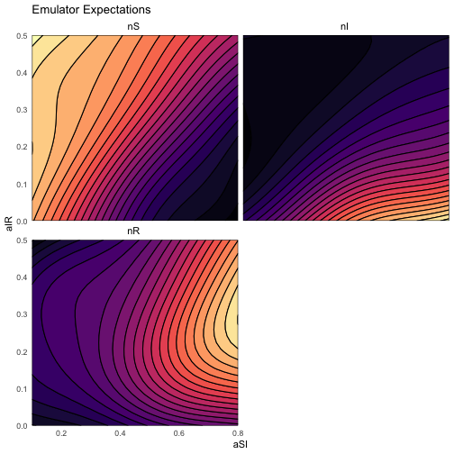

```r
emulator_plot(wave1_emulators$nS, params = c('aSI', 'aIR'), fixed_vals = list(aSR = 0.03))
```


```r
emulator_plot(wave1_emulators$nI, plot_type = 'var')
```

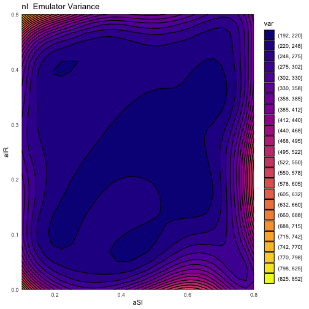

```r
emulator_plot(wave1_emulators$nI, plot_type = 'sd')
```

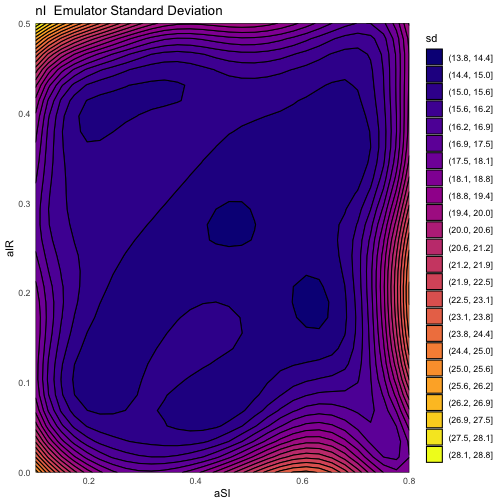

Almost all the return values of plots produced by `hmer` are `ggplot` objects, and so can be augmented after the fact.


```r
emulator_plot(wave1_emulators$nS, params = c('aIR', 'aSI')) + ggplot2::geom_point(data = SIRSample$training, ggplot2::aes(x = aSI, y = aIR))
```

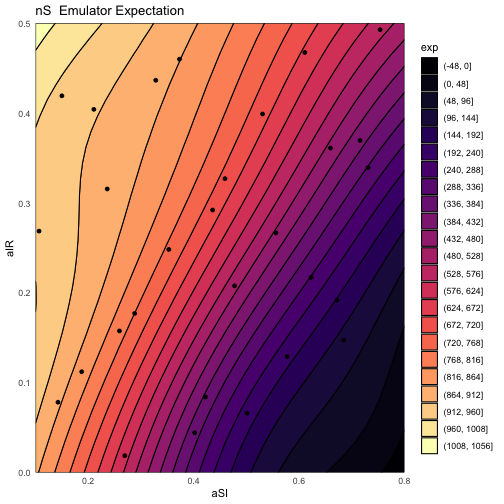

Using these, we can plot implausibility across the parameter space, again using `emulator_plot`. We can also combine the implausibilities into a combined measure of point suitability by considering maximum implausibility across all outputs. While traditionally, implausibility plots are green-red, a colourblind friendly palette is available with the use of `cb=TRUE`.


```r
emulator_plot(wave1_emulators, plot_type = 'imp', targets = targets)
```

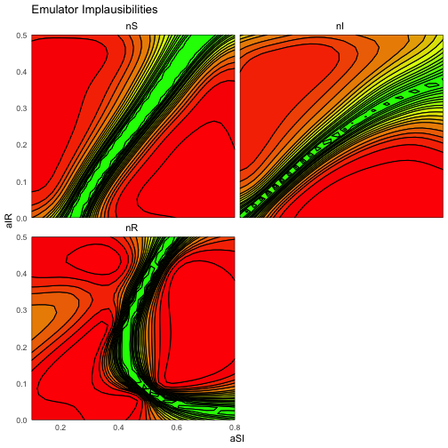

```r
emulator_plot(wave1_emulators, plot_type = 'nimp', targets = targets, cb = TRUE)
```

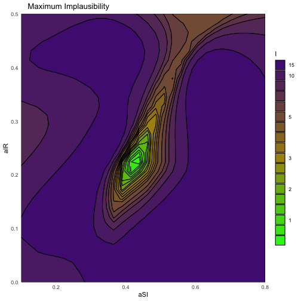

While these plots represent slices of parameter space, other functionality allows a rough understanding of the behaviour across the full space.In particular, the `plot_lattice` function provides a plot of optical depth and minimum implausibility for all parameter combinations. Since this is generating a plot that represents the full space and not a two-dimensional slice, it typically takes a little longer than the previous plots considered.


```r
plot_lattice(wave1_emulators, targets)
#> `geom_smooth()` using method = 'loess' and formula 'y ~ x'
#> Warning: Removed 27 rows containing missing values (geom_smooth).
#> `geom_smooth()` using method = 'loess' and formula 'y ~ x'
#> Warning: Removed 25 rows containing missing values (geom_smooth).
#> `geom_smooth()` using method = 'loess' and formula 'y ~ x'
```

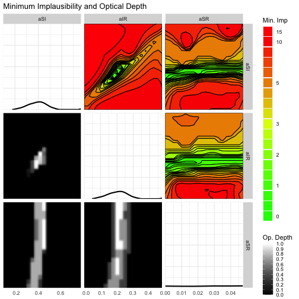

## Proposing new points for the model

In preparation for proposing new points, we can also look at the optimal 'cutoff', if we wish to remove a certain amount of parameter space, using the `space_removed` function.


```r
space_removed(wave1_emulators, targets, ppd = 15) + geom_vline(xintercept = 3, lty = 2)
```

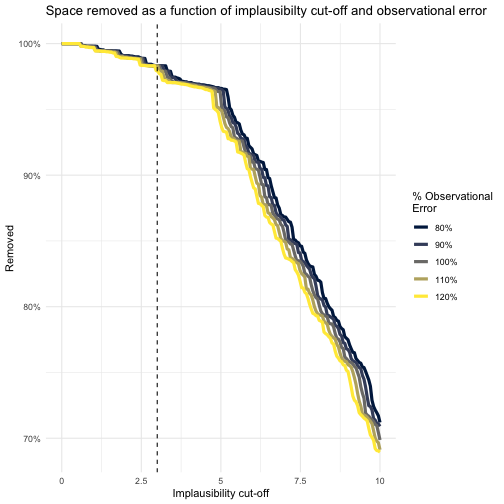

We see, for instance, that choosing a cutoff of 3 (roughly corresponding to a 3-sigma deviation from the target value) is sufficient to rule out over 95% of the space - coupled with the fact that our diagnostics were so healthy suggests that this is a very reasonable first cut. This is heuristic based on the number of points we provide to the function: the `ppd` (points-per-dimension) argument determines the size of the grid we evaluate over. Here we have considered $15^3=3375$ points - if we wanted to examine the space removed in greater depth we could increase the value of this argument. A similar argument exists for `plot_lattice`.

Eventually, the aim of history matching is to propose new points which can enter into the model, the results of which can train new emulators, repeating the cycle; the `generate_new_runs` function does just that. There are multiple options that can be passed to this function: the default behaviour should be adequate for most situations, with the consideration of the cutoff value mentioned above. Information about the progress of the point proposal can be suppressed by setting the argument `verbose = FALSE` - by default it will be `TRUE` if we are stepping through this by hand, but not if we run this at arm's length (for example on a cluster).


```r
new_points <- generate_new_runs(wave1_emulators, 90, targets)
#> Proposing from LHS...
#> 15 initial valid points generated for I=3.806
#> Performing line sampling...
#> Line sampling generated 38 more points.
#> Performing importance sampling...
#> Importance sampling generated 50 more points.
#> 75 initial valid points generated for I=3
#> Performing line sampling...
#> Line sampling generated 40 more points.
#> Selecting final points using maximin criterion...
#> Resample 1 
#> Performing line sampling...
#> Line sampling generated 40 more points.
#> Performing importance sampling...
#> Importance sampling generated 8 more points.
#> Selecting final points using maximin criterion...
plot(rbind(rbind(SIRSample$training, SIRSample$validation)[,names(input_ranges)], new_points), pch = 16, cex = 0.8, col = rep(c('black', 'blue'), each = 90))
```

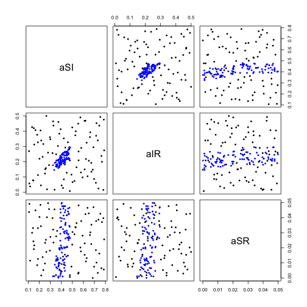

The plot command above is replicated in the `hmer` package itself, to a degree. We first create a list of 'waves'; each element of the list is a data.frame containing all points proposed at that time. For now, we merely look at the proposed points and not the resulting model values.


```r
wave.points <- list(SIRSample$training[,c('aSI', 'aIR', 'aSR')], new_points)
```

There are a number of explanatory plots that can be produced, given a set of wave data. Some require the model to have been run on the points, but one that doesn't is `wave_points`:


```r
wave_points(wave.points, c('aSI', 'aIR', 'aSR'))
```

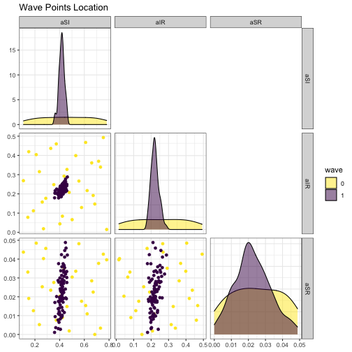

This shows the evolution of the point proposals as the waves go on. In each lower-diagonal plot, we have a plot of the proposed points with respect to two of the parameters; in the diagonal is a density plot for each parameter. This allows us to consider the shape of the non-implausible space as we proceed through the history match. Related functions, with similar output, are `wave_values` and `wave_dependencies`, both of which we detail in the next section.

## Multi-wave plotting

As mentioned above, functions exist to visualise the evolution of the non-implausible space and the points proposed. By definition such plots require us to have performed multiple waves of history matching - rather than repeat the commands above we will use the `SIRMultiWaveData` dataset provided. This contains a list of four waves of points from this model (including wave 0), along with the model evaluations. We can use this to look at dependencies of the outputs on the inputs (`wave_dependencies`), the evolution of the output values obtained (`wave_values`), and the overall behaviour of the model runs (`simulator_plot`).


```r
wave_values(SIRMultiWaveData, targets)
```

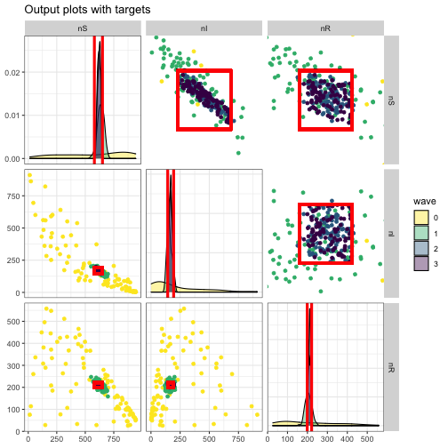

```r
wave_dependencies(SIRMultiWaveData, targets)
```


```r
simulator_plot(SIRMultiWaveData, targets, barcol = 'white')
```

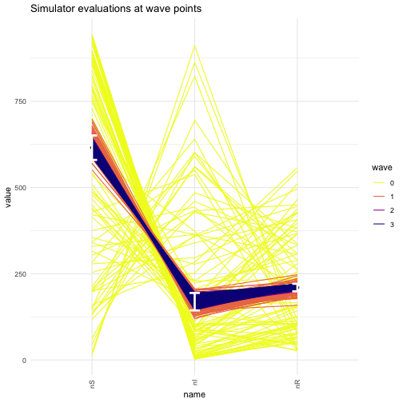

All of these plots, as well as `wave_points`, are wrapped into a single function, `diagnostic_wrap`. This will also produce log-transformed and normalised versions of the simulator plot, for situations where the outputs have vastly different magnitudes (for example, when matching to a proportion of infected people as well as raw case numbers).

## Hands-off Emulation and History Matching

Each of the functions in constructing emulators has a number of options with which the default behaviour can be modified. However, if investigation of the emulator structure is not required and one simply wants the next set of proposed points, then the `full_wave` function allows this. It requires only a set of points to train the emulators on. If applying this at later waves, the emulators from previous waves are provided as a list to the `old_emulators` argument.


```r
f_w <- suppressWarnings(full_wave(do.call('rbind.data.frame', SIRSample), list(aSI = c(0.1, 0.8), aIR = c(0, 0.5), aSR = c(0, 0.05)), targets))
#> Training emulators...
#> Fitting regression surfaces...
#> Building correlation structures...
#> Creating emulators...
#> Performing Bayes linear adjustment...
#> Performing diagnostics...
#> Generating new points...
```

This provides two things: a next set of points to evaluate the model on, and the emulators that gave rise to them. One should exercise caution when using this - while the function does what it can to ensure that emulators trained and points proposed are done in the most reasonable way, it is no substitute for expert judgement and consideration. Nevertheless, it can be a useful tool for a 'first pass' at emulating a system.
