## Introduction

Calibration of models is a complex process and can pose a number of different hurdles and complications. This document serves to identify a few common issues, how they would present in usage of the package, and how best to rectify or circumvent such problems. This is not an exhaustive list of issues that can arise in emulation and history matching, but is an attempt to highlight those that occur most frequently, as well as some behaviours that may seem 'weird' when encountered.

Fundamentally, every model and application thereof is different. The amount of time spent emulating a model should respect the amount of time it took to create the model; the emulation can give insights into the behaviour of the model, any potential issues with how the model behaves in parts of the parameter space, or highlight implicit structure within the model. A complex and carefully-constructed model deserves an equally careful treatment when calibrating it to data.

## FAQ

- The emulators don't seem to behave as we'd expect: [not space-filling?](#training-suitability) [model behaviour not represented in runs?](#model-incompatibility) [lost points in transition from model?](#model-nas)

- The emulators can't propose any non-implausible points: [not enough model discrepancy?](#model-discrepancy) [hard-to-match outputs in early waves?](#output-choice)

- Both of the above problems: [is there a useful transformation of the outputs?](#output-transformation)

- An emulator plot looks odd: [what are the active variables?](#active-vars)

- Visualisation of the space is slowing the history match: [can we prioritise sensible visualisations?](#visualisation-choice)

- The point proposal is slow: [change the options for point proposal?](#proposal-speed)

- The proposed points look to have a strange structure: [is the target space small or disconnected?](#small-spaces) [has the sampling omitted a small part of the space?](#resampling-consideration)

## Model preparation

### Training run suitability and specification {#training-suitability}

Emulators are statistical surrogates for a complex model and have a number of strengths (not least, speed comparative to model evaluations), but fundamentally they only have predictive power relative to the data they are provided. While in later waves of history matching points proposed by emulators aim to provide space-filling designs over the current non-implausible region, the initial points provided by a user are under no such restrictions. If an initial set of points miss large regions of the parameter space then the emulators will offer no useful insight into this region. This is accounted for in the emulator uncertainties **provided the data is wide-ranging enough to indicate the variability across the space**. The definition of 'wide-ranging' here is nebulous and highly dependent on the nature of the model, but we give an example below.

Suppose we have a situation where our training runs focus on a subset of the region. If we expect the emulators to extrapolate to the entire space, we might not be surprised that the result is sub-optimal. The most extreme example is if we focus on a subregion where a target is consistently over- or under-estimated: it is possible to train emulators that have low uncertainty (due to the consistency of the output) but simultaneously cannot attain a target value even if we know a match is possible. We will use the SIR model used in the `SIRSample` dataset and similar to illustrate this.


```r
bad_design <- data.frame(aSI = runif(30, 0.6, 0.8),
                         aIR = runif(30, 0, 0.1),
                         aSR = runif(30, 0, 0.05))

bad_results <- get_res(bad_design)
bad_emulators <- emulator_from_data(bad_results, c('nS', 'nI', 'nR'),
                                    ranges = list(aSI = c(0.1, 0.8), aIR = c(0, 0.5), aSR = c(0, 0.05)))
#> Fitting regression surfaces...
#> Building correlation structures...
#> Creating emulators...
#> Performing Bayes linear adjustment...
```

In a circumstance such as this, we may find that the emulator diagnostics are 'fine', albeit with high values of implausibility in the misclassification diagnostics (the middle column). However, attempts to generate runs will fail to find points within a respectable implausibility threshold (prompting additional output from `generate_new_runs`), and an aid to identification will be returned: namely, a set of box plots of the implausibilities for each output as well as a printed check on the training outputs to see if there is a consistent over- or under-estimation of one or more targets.


```r
bad_design_v <- data.frame(aSI = runif(30, 0.6, 0.8),
                         aIR = runif(30, 0, 0.1),
                         aSR = runif(30, 0, 0.05))
bad_validation <- get_res(bad_design_v)
invalid <- validation_diagnostics(bad_emulators, SIREmulators$targets, bad_validation)
```

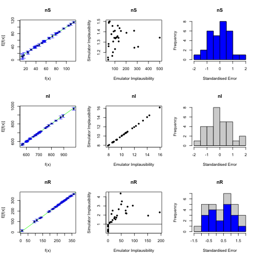


```r
try_generate <- generate_new_runs(bad_emulators, 100, SIREmulators$targets, verbose = TRUE)
#> Proposing from LHS...
#> 15 initial valid points generated for I=8.86
#> Performing line sampling...
#> Line sampling generated 40 more points.
#> Performing importance sampling...
#> Importance sampling generated 110 more points.
#> 14 initial valid points generated for I=4.676
#> Performing line sampling...
#> Line sampling generated 40 more points.
#> Performing importance sampling...
#> Importance sampling generated 85 more points.
#> Point proposal seems to be asymptoting around implausibility 3.643 - terminating.
#> Target nS consistently underestimated.
#> Target nI consistently underestimated.
```

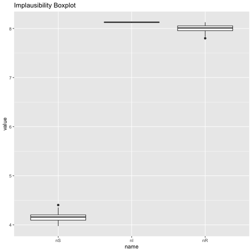

```
#> Inspect implausibility boxplot for problematic outputs, and consider transforming them or removing them from this wave.
#> Resample 1 
#> Performing line sampling...
#> Line sampling generated 40 more points.
#> Performing importance sampling...
#> Importance sampling generated 81 more points.
#> Selecting final points using maximin criterion...
```

If we encounter this problem, it is worth returning to our initial design and considering whether including additional training points would be appropriate or whether our initial design was poorly specified.

Similar issues can arise from errors in specifying parameter ranges or converting output data from a model not run in R: one should do as many 'sanity checks' as are possible and expeditious to confirm that the information being provided to emulators is correct.

### Output choice {#output-choice}

One of the advantages of the history matching paradigm is that it finds good regions of parameter space via complementarity: each wave of history matching removes regions that it can be certain will not fit the targets under consideration. We can leverage that power by being judicious about which outputs we match to at each wave. A common situation for epidemiological models is that, when the full parameter space is considered, not all outputs of interest are informative (or even varying at all). Were we to zoom in on a smaller superset of the good parameter space, these uninformative outputs can contribute in a meaningful way to the analysis of the space. If we include only the informative targets at a given wave we can reduce the parameter space so that subsequent waves of history matching can address the more intricate outputs. The nature of history matching is that this decision does not adversely affect the identification of the final good parameter space, since omission of an output makes the restrictions on the non-implausible space for a wave less stringent.

The converse of the above is that including uninformative outputs can bias the results of a history match by falsely suggesting constancy of outputs that in fact vary only in small regions of parameter space. For example, consider a simple SIR model with no vital dynamics where we wish to match to the number of infected and deceased people at some number of time points. Suppose the observed data we are matching to indicates a very high number of deaths despite a relatively low infected population, suggesting that the parameter controlling the transition $I \to D$ is extremely high. For an initial set of (space-filling) runs, we may find that this interplay means that all of our parameter sets give rise to very few, or no, deaths. Were we to include all outputs we may come to the conclusion that a match cannot be attained, since none of our model runs suggest that a high number of deaths is achievable. If we instead spend a few waves matching to the number of infected people before including the deaths, the later waves will be able to more easily identify the regions of interest.

### Model Discrepancy {#model-discrepancy}

Even the most complex model is unlikely to perfectly replicate the intricacies of the real-world system it reflects, and observational data is equally difficult to obtain with perfect clarity. While the desire to obtain 'perfect matches' from the model with respect to data is natural, it should be tempered by an understanding of the constraints and shortfalls of modelling reality. Even in deterministic models small choices like the numerical method by which differential equations are solved, or machine precision, can give rise to different outcomes.

Emulators accept a variety of sources of uncertainty and incorporate those into the framework of history matching. They automatically encapsulate the uncertainty in their own construction and approximation of the model, but do not automatically make judgements about the validity of model runs or suitability of targets to match to. If these uncertainties are not taken into account, it is entirely possible that the region of parameter space that would correspond to the real-world situation is overlooked in history matching.

When using emulation, it is helpful to consider the following, non-exhaustive, checklist:

- Do the bounds of the targets accurately reflect the uncertainty in the observational process? Features like systematic bias from under-counting or under-reporting, or additional uncertainty coming from the use of composite measures (for example, the ratio of two observations where each has an uncertainty attached to it) should be carefully considered and represented in the targets provided to the emulators.

- Are our judgements about any fixed parameters in the model reasonable? It is common to have complex models where we identify a subset of the inputs as influential on the model output, and fix the remainder at sensible values. One way to account for this fixing of variables is to do a sensitivity analysis on the model with respect to those fixed parameters. A simple approach is, for each fixed parameter, to consider small perturbations around its fixed value (while holding all other parameters fixed) and analyse the effect on the model output. The combination of the variability in all fixed parameters gives an estimate of the **internal discrepancy** in the model for each output.

- Are there any parts of the model itself which we could augment or change to better reflect the reality it models? If, given the time and computational resource, we could improve the model to produce results that are closer to reality, then we cannot ignore the deficiency the model suffers without those changes. A common case occurs in agent-based models, where it is seldom possible to simulate every person in a country (or even region of a country): quantifying this discrepancy can be done by considering the model for different numbers of agents and looking at the change in output. This collection of uncertainties, termed **external discrepancy**, is often hard to quantify rigorously: this does not mean that they should be swept aside.

All of these quantities can be offered to the emulators. The target uncertainty is the most straightforward, arising naturally from the provision of targets to the emulators; the internal and external discrepancies can be provided to `emulator_from_data` as a list of lists, where each element corresponds to an output and contains named elements `internal` and `external`.

It may seem counterproductive to make the emulators 'more uncertain' (especially when doing so leads to 'good' points that do not provide perfect fits to the data), but the inclusion of discrepancy is fundamental to producing an accurate representation of the parameter space of interest.

The variety of visualisation tools in the `hmer` package can give an insight, where complete matches to data were not possible, as to the potential structure of the discrepancy. Given a output that we require to be within the region $[a, b]$, if via `wave_values` we see that the best points proposed by history matching can get no closer to its target than $b+0.1$ (say), then this does not necessarily mean that the target cannot be attained. It could be that there is a hitherto unconsidered reason that the targets we have set are too stringent or it could be that slight modification of one of the fixed values in the model, or an aspect of the model itself, could account for the excess in the output. Discrepancy analysis should not be seen as a barrier to matching reality but as an opportunity to gain a deeper understanding of the physical process and the pitfalls in modelling it.

### Model Incompatibility {#model-incompatibility}

The emulators are most powerful when they act as interpolators over the region of interest - by which we mean the region where we expect the model to be adequate in fitting to the observed data (given the uncertainties mentioned above). If the points on which the emulators are trained do not give rise to anything approaching a fit to data, even univariately, then we may not be surprised if this results in emulators that do not believe a match can be found.

As an example, we consider the dataset provided in `problem_data`; this consists of training data from a model consisting of 21 inputs and 19 outputs. Along with this are the defined targets and ranges, as well as an 'extra' set of points which includes the best found fit for the model using hand-fitting. It will be important to note that, aside from outputs 13, 14, 16, and 17, all outputs are proportions or ratios (taking values within $[0,1]$). The central feature of this model is that acceptable matches lie in a 'trench' at in a small corner of the space, for which many of the inputs are at, or close to, their minimum values.

We try to train a set of emulators to this dataset in the normal fashion. The one change is that we use the `targets` argument of `emulator_from_data` in order to gain an insight into the structure of the data.


```r
problem_ems <- emulator_from_data(problem_data$data, names(problem_data$targets), problem_data$ranges, targets = problem_data$targets, more_verbose = FALSE)
#> Target output5 consistently overestimated.
#> Target output7 consistently overestimated.
#> Target output9 consistently overestimated.
#> Target output10 consistently overestimated.
#> Target output15 consistently overestimated.
#> Target output18 consistently overestimated.
#> Some outputs may not be adequately emulated, due to consistent over/underestimation in training data.
#> Consider looking at the outputs (using, eg, behaviour_plot); some outputs may require extra runs and/or transformation.
#> Warning in emulator_from_data(problem_data$data, names(problem_data$targets), : Fewer than 210 non-NA points in 21 dimensions
#> - treat the emulated outputs with caution, or include more training points (minimum 10 times the number of input parameters).
#> Fitting regression surfaces...
#> Building correlation structures...
#> Creating emulators...
#> Performing Bayes linear adjustment...
```

There are a few things of interest here, but we will focus on the first few printed statements. They indicate that some of the outputs to match to are consistently over-estimated - this in and of itself is not guaranteed to be a problem, but it always warrants further study. We can look at the behaviour of one of the identified outputs from the model perspective using a simple plot command.


```r
plot(x = problem_data$data[,names(problem_data$ranges)[9]], y = problem_data$data[,names(problem_data$targets)[7]],
     pch = 16, xlim = problem_data$ranges[[9]], ylim = c(0, 1), xlab = "Parameter", ylab = "Output")
abline(h = problem_data$targets[[7]], lty = 2)
```

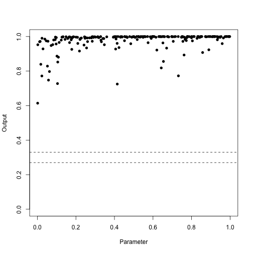

As suggested, we may also use `behaviour_plot` to look at the emulator predictions. This can replicate the above behaviour if given the points and no emulators, but we want to look at the emulator behaviour here.


```r
behaviour_plot(ems = list(problem_ems[[7]]), targets = problem_data$targets)
```

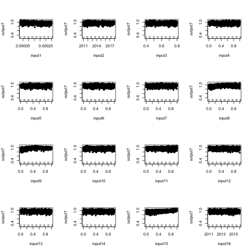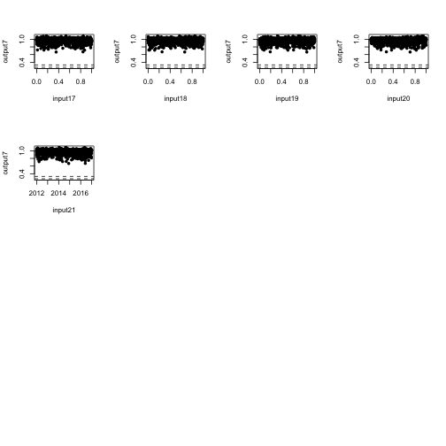

We can see that, for some inputs we begin to see an indication of the 'trench' behaviour to the left-hand side of the input values. However, it does not truly see the steep drop-off and it is nowhere near the target, predicting a range of output7 of approximately $[0.7, 1]$.

The target is some distance away from any of the points used to train it, and in fact the data we have available to train the emulators is fairly consistent across the chosen input. One can play around with different inputs or other problematic outputs and find that this issue is commonplace.

This data is used in two ways by the emulator: first to set up vague prior statements about the global structure of the space and the correlation between neighbouring points, and second to perform the Bayes linear adjustment relative to this data. If the data suggests that the output is more or less constant across the input space, and a long way away from the target, then we should not be surprised if the emulator is moderately certain that a match to the data cannot be found.

One solution to this issue is to omit an output of this type from the particular wave of emulation (as mentioned earlier), but this may mask the true problem. It is always worthwhile investigating targets flagged by `emulator_from_data` in order to understand the task we are asking the emulators to do. Perhaps it becomes clear that, at least for wide ranges, this target is unsuitable for emulation; there is another thing that we can consider doing, detailed below.

### Output Transformations {#output-transformation}

The above problem has its roots in the nature of the model. We may conclude that this output is very unlikely to be matched, but remember that we only use a (comparatively) small number of points to train the emulators. If there are interesting and relevant behaviours in a very small part of the parameter space, it is entirely possible that we have simply missed them. In this example, we know the answer: let us include the 'extra' points in the above plot:


```r
plot_data <- rbind(problem_data$data, problem_data$extra)
plot(x = plot_data[,names(problem_data$ranges)[9]], y = plot_data[,names(problem_data$targets)[7]],
     pch = 16, xlim = problem_data$ranges[[9]], ylim = c(0, 1), xlab = "Parameter", ylab = "Output",
     col = c(rep('black', nrow(problem_data$data)), rep('blue', nrow(problem_data$extra))))
abline(h = problem_data$targets[[7]], lty = 2)
```

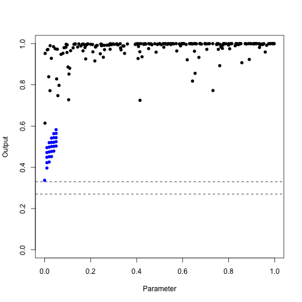

In fact, in a small part of the parameter space (somewhere near what turns out to be a 10d 'corner' of the space) this target comes much closer to being attained. The behaviour of the output is very interesting: in the vast majority of the input space it settles consistently at high values. As we get close to this corner, it steeply drops off into the trench where the acceptable matches can be found. It is not reasonable, therefore, to just dismiss these outputs out of hand: they do in fact contain useful information about the structure of the space.

One way to potentially elicit this information is to consider a transformation of the outputs. The relevant transformation depends on the nature of the data: here, given that the output values are between 0 and 1, we might consider a `logit` transformation. Care must be taken with this transformation, including the fact that the logit transformation acts on $(0,1)$ and not $[0,1]$; here however we simply outline a sketch of the solution.


```r
logit_data_first <- problem_data$data
logit_data_second <- problem_data$extra
logit_data_first$output7 <- log(logit_data_first$output7/(1-logit_data_first$output7))
logit_data_second$output7 <- log(logit_data_second$output7/(1-logit_data_second$output7))
logit_data_first <- logit_data_first[is.finite(logit_data_first$output7),]
logit_data <- rbind(logit_data_first, logit_data_second)
plot(x = logit_data[,names(problem_data$ranges)[9]], y = logit_data[,names(problem_data$targets)[7]],
     pch = 16, xlim = problem_data$ranges[[9]], ylim = range(logit_data[,names(problem_data$targets)[7]]), xlab = "Parameter", ylab = "Output",
     col = c(rep('black', nrow(logit_data_first)), rep('blue', nrow(logit_data_second))))
abline(h = log(problem_data$targets[[7]]/(1-problem_data$targets[[7]])), lty = 2)
```

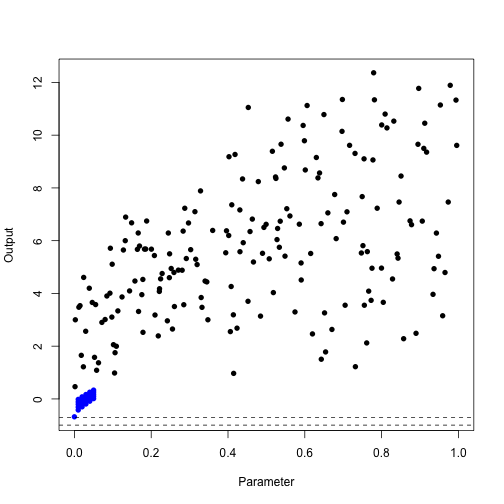

This transformation has pulled the original data and the 'corner' data closer together, but more importantly it has helped to distinguish what appeared to be very similar behaviour of the original data. Training an emulator to this transformed data stands a better chance of giving us a sensible result, with an appropriate estimation of the uncertainty. Indeed, we can see this by comparing an emulator trained to the original data and one trained to the transformed data. The slice we choose is along the two parameters that are identically 0 in the 'best fit' point, with all other parameters set to their 'best fit' values.


```r
plot(problem_ems[[7]], plot_type = 'imp', params = c('input9', 'input15'), fixed_vals = problem_data$extra[1,(1:21)[-c(9, 15)]], targets = problem_data$targets)
```

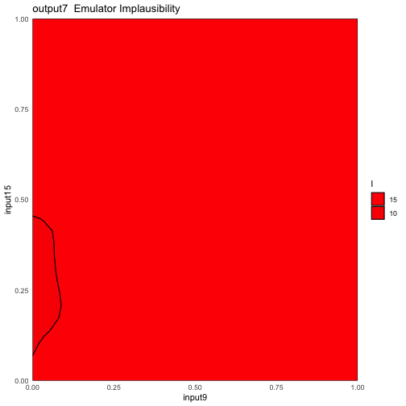

```r
new_emulator <- emulator_from_data(logit_data_first, c('output7'), problem_data$ranges)
#> Warning in emulator_from_data(logit_data_first, c("output7"), problem_data$ranges): Fewer than 210 non-NA points in 21
#> dimensions - treat the emulated outputs with caution, or include more training points (minimum 10 times the number of input
#> parameters).
#> Fitting regression surfaces...
#> Building correlation structures...
#> Creating emulators...
#> Performing Bayes linear adjustment...
plot(new_emulator$output7, plot_type = 'imp', params = c('input9', 'input15'), fixed_vals = logit_data_second[1, (1:21)[-c(9, 15)]], targets = list(output7 = log(problem_data$targets$output7/(1-problem_data$targets$output7))))
```

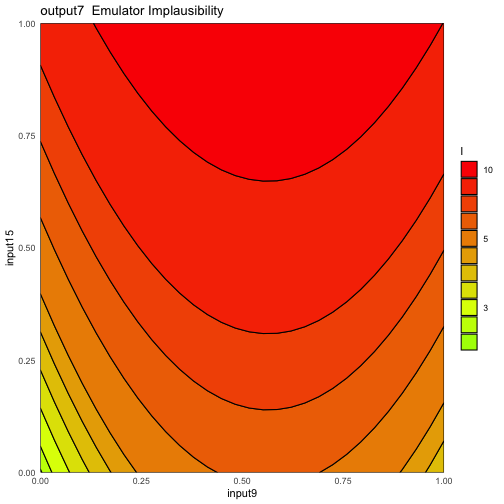

We can see a marked difference in the implausibility, and checking the print statements from the two emulators will show a big difference in the level of uncertainty: the transformed emulator is more uncertain simply because it is being exposed to a wider range of behaviour. Note that we did not train the transformed emulator on our 'extra' points: this emulator had no greater knowledge about the space than the original emulator.

Any transformation used must be considered carefully (potentially with recourse to any previously trained emulators). There is no algorithmic solution to this sort of problem: it is not the case that we simply perform the same transformation to any ratio output, nor that the transformation does not introduce other strange behaviour. It is up to the judgement of the user to explore the best way to represent the changing behaviour of the model across parameter space.

### Model NAs {#model-nas}

Some models can return non-numeric output values, particularly where the model could give rise to non-physical results and is terminated early. This is a good approach to error handling in model evaluation, but can cause false inference when training emulators.

The rough rule of thumb for training emulators is that we require "a number of training points equal to ten times the number of parameters". However, this should not be taken as an absolute: this is the minimal number of points required for it to be even possible that we can infer anything from emulator diagnostics or, indeed, the emulators themselves. For most situations, this rule holds true and if we have a validation set of points aside from these, then we can be fairly confident in how the emulators are performing; however, one should consider carefully whether a model has sufficiently complex behaviour that we should increase the number of runs.

The `emulator_from_data` call of the above 'problem' model flagged one additional thing while training: namely that there were fewer than $10d$ points available for training. This happened both in the original and the transformed case: in the former case a few model runs were lost due to NAs existing in some of their outputs; in the latter case it was exacerbated by the removal of some output values that were exactly 0 or 1 before transformation, resulting in a non-finite output in the transformed data. In both cases, we can rectify this at the model evaluation stage: if one suspects that some training points will be lost to problems with NA values or at the transformation stage, then we should create an initial design containing more points than the $10d$ threshold. Providing slightly more points to the emulators is not deleterious to either performance or speed, while providing fewer can be very problematic. Generally, an additional $10\%$ of points should suffice, but this should be tailored to the behaviour of the model itself.

## Final Note on Model-related Concerns

Many of the problems detailed above are only common at early waves; especially when the parameter space is large. Once one or two waves of carefully trained emulators have ruled out the most egregious parts of parameter space, the stability of the model results and of the structure of the output space is greatly increased. When performing history matching, it is always worth carefully considering the first few waves of the match - not just from the point of view of obtaining acceptable matches to data, but also to gain an understanding about the structure of the model that we are trying to match to.

## Emulator Visualisation

### Emulator Plots and Active Variables {#active-vars}

There are a variety of functions in the package to visualise the behaviour of the model and of the emulated surface. Some of these require some careful consideration, and one such instance is the `emulator_plot` function. This provides a contour plot of an emulated output on a particular two-dimensional slice of the input parameter space, and can be helpful in identifying the large-scale behaviour and response of an output. However, the structure of the emulators can suggest strange behaviours if we choose an uninformative slice (or call the function with its default behaviour).

As an example, consider again the `problem_data` dataset. We can easily obtain the specifications of the emulator corresponding to (transformed) output7, and find that it has a set of 'active variables': namely inputs 1, 8, 9, and 15, which we can see using the `plot_actives` command.


```r
plot_actives(new_emulator)
```

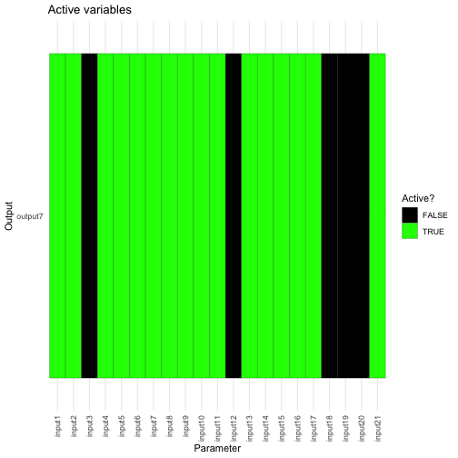

We know that at a training point, the emulator should exactly replicate the output value and that the uncertainty at this point is 0, so let us plot this:


```r
plot(new_emulator$output7, params = c('input1', 'input8'),
              fixed_vals = problem_data$data[1,(1:21)[-c(1,8)]]) +
  geom_point(x = problem_data$data[1,1], y = problem_data$data[1,8])
```

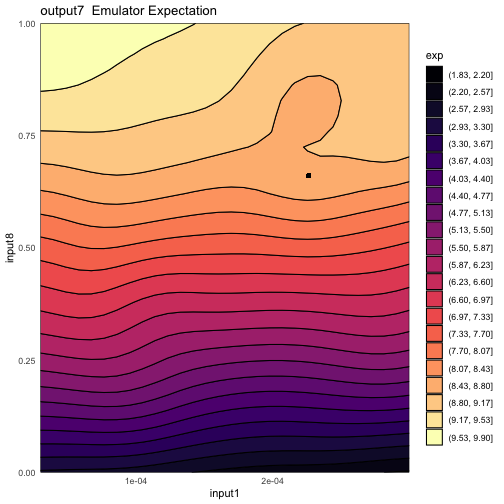

```r
plot(new_emulator$output7, plot_type = 'sd', params = c('input1', 'input8'),
              fixed_vals = problem_data$data[1,(1:21)[-c(1,8)]]) +
  geom_point(x = problem_data$data[1,1], y = problem_data$data[1,8])
```


Now, let's do the same with inputs 2 and 3:


```r
plot(new_emulator$output7, params = c('input2', 'input3'),
              fixed_vals = problem_data$data[1,(1:21)[-c(2, 3)]]) +
  geom_point(x = problem_data$data[1,2], y = problem_data$data[1,3])
```

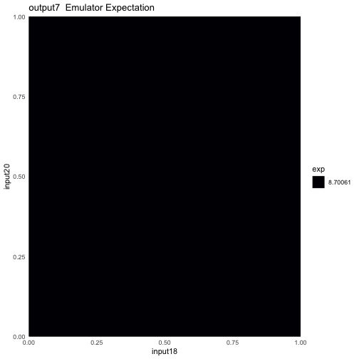

```r
plot(new_emulator$output7, plot_type = 'sd', params = c('input2', 'input3'),
              fixed_vals = problem_data$data[1,(1:21)[-c(2,3)]]) +
  geom_point(x = problem_data$data[1,2], y = problem_data$data[1,3])
```

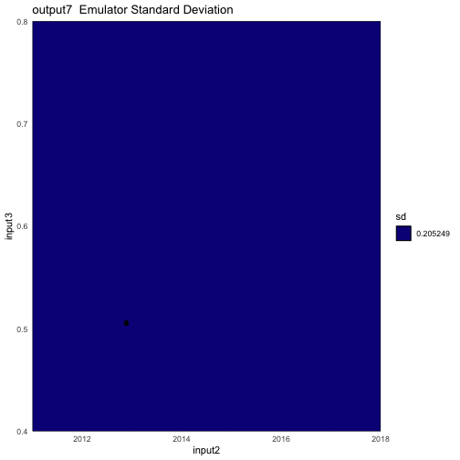

The expectation surface appears to be completely flat across the surface, as does the standard deviation. What's going wrong here?

The answer is that nothing is going wrong. The way that the emulator determines correlation, which in turn determines the structure of the Bayes linear update, is by recourse to active variables. Recall that the structure of the correlator is

$$\text{Cov}[u(x), u(x^{\prime})] = (1-\delta)\sigma^2c(x_A,x_A^{\prime}) + \delta \sigma^2 I_{x=x^{\prime}}$$

for some correlation function $c(x, x^{\prime})$ - the $A$ subscript indicates that we are only considering the active variables in the correlation function. The active variables, in turn, are defined as those parameters that contribute meaningfully to the global structure of the space; i.e. the regression surface. Let's consider taking a slice across parameter space in two of the non-active directions. The regression surface does not change across this slice by definition; the correlation between any training point and any point on this slice is identical, as all points on the slice have an identical value of the active variables. Thus the Bayes linear update uniformly modifies their expectation and variance by an identical amount, giving rise to the above 'constant' plots. This is the pitfall of using lower-dimensional slices of a high-dimensional parameter space to try to gain an intuition into the full space.

But if a training point is included in the slice (as we did above), shouldn't we expect at least some variation? Shouldn't there be a single point in the standard deviation plot where it is zero? The answer is yes, but it is almost impossible to pick this up in the plot. The nature of the correlation structure is that there is a discontinuous jump akin to a Dirac delta when $x=x^{\prime}$ (due to the $I_{x=x^{\prime}}$ term), so that at a single point the variance drops to identically zero. When creating the contour plots, this cannot be accommodated. We can see this clearly by creating a one-dimensional plot across one of the non-active variables:


```r
dm <- matrix(0, ncol = length(problem_data$ranges), nrow = 1000)
for (i in 1:length(problem_data$ranges)) dm[,i] <- rep(problem_data$data[1,i], 1000)
dm[,2] <- sort(c(problem_data$data[1,2], seq(problem_data$ranges[[2]][1], problem_data$ranges[[2]][2], length.out = 999)))
data1d <- setNames(data.frame(dm), names(problem_data$ranges))
vars <- new_emulator$output7$get_cov(data1d)
plot(x = data1d$input2, y = vars, type = 'l', xlab = "input2", ylab = 'Variance')
```

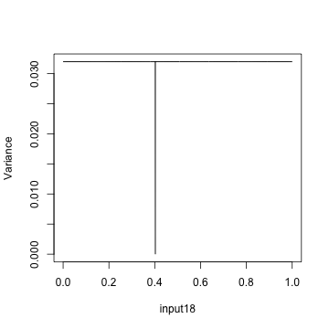

Such 'constant' plots should not be a concern - they represent the actual behaviour of the emulator on the slice in question.

### Choice of Visualisation {#visualisation-choice}

The `hmer` package has a multitude of functions that allow us to visualise the emulator behaviour and that of the model. On a wave-by-wave basis, however, it is not necessarily useful or expedient to consider all of them. Here, we detail the main visualisations in roughly increasing order of computational time and their most appropriate use. Not included here are the diagnostic plots (particularly `validation_diagnostics`) - these should be performed at every wave of the history matching process to ensure the quality of the trained emulators.

- Emulator Specification plots (`plot_actives(...)`, `behaviour_plot(...)`, `effect_strength(...)`): plots which focus on an aspect of the emulator structure. These are fast and give an insight into the global behaviour of the emulator: for example, which parameters are dominating the structure of the non-implausible space. They by no means give an exhaustive description of the emulators or of the model space, but are useful as 'sanity checks' or exploratory analyses.

- Emulator plots (`emulator_plot(...)`, `plot(em, ...)`): shows behaviour on a 2-dimensional slice of parameter space for expectation, variance, standard deviation, implausibility, or maximum implausibility. Comparatively fast and useful for looking at interesting aspects of the emulated surface (for example, looking at how an output is affected by two important variables). The caveat is that we are only ever looking at a 2d slice of the space, and forgetting this can lead to dangerous conclusions.

- Multiwave and model output plots (`wave_<aspect>(...)`, `simulator_plot(...)`): these are useful for visualising the progress of a history match and, in some cases, the reasons why we are unlikely to find a match to data and potential solutions. Their speed depends on the number of waves and at later points in the history match it can be useful to remove early waves where the structure of the non-implausible space is vague. The `wave_numbers` argument is often the means by which this is achieved.

- Projected and aggregated plots (`plot_lattice(...)`, `space_removed(...)`): projects the full space into a collection of lower-dimensional subspaces, giving representations of implausibility and/or optical depth. These plots give a more in-depth representation of the implausibility structure of the entire space and of suitable implausibility cutoffs at a given wave without resorting to slices. The downside is the increased computational time - the number of evaluations can be controlled by the `maxpoints` (for `plot_lattice`) or `ppd` (for `space_removed`) argument. Higher values of these give a fuller description of the space at greater computational cost.

As a general rule of thumb, at each wave visualisations from the first two categories can be useful to gain an insight into the model behaviour, along with `space_removed` (with a value of `ppd` appropriate to the complexity of the space) for a heuristic justification for a given implausibility cut. Visualisations such as `wave_values` and `plot_lattice` are typically useful for providing a final determination about the structure of the non-implausible space rather than performing them at each wave.

## Proposing Points

### Proposal Speed {#proposal-speed}

The major advantage of emulation is that predictions at unseen points can be performed in a fraction of the time that the equivalent model evaluations would take. This feature is taken advantage of when we propose points by evaluating large numbers of points across the space in order to find the most informative parameter sets for model evaluation. Of course, it can seem (especially at higher waves, when multiple emulators are being used per output) that the proposal stage is slower than ideal.

Something to bear in mind in this circumstance is that the comparisons made are sensible. If we wish to generate $100$ points, the point generation stage will typically test between $2000$ and $10000$ points depending on the shape and size of the non-implausible region. One should therefore compare performance of the model not against the time taken to run $100$ simulations but that required to run $2000$ simulations.

One thing that can be helpful to speed the process, or at least utilise model run time efficiently, is to have point generation produce far more points than are required for emulator training. This can be done in tandem with the `to_file` argument to `generate_new_runs` so that proposed points are periodically saved outside of the current R session. Once a sufficient number of points have been proposed for the purposes of training, the model runs can be started while the emulators continue to propose points.

While counter-intuitive, this can be advantageous at later waves. If we have a large collection of points proposed at wave $n$, then we can check the validity of those points at wave $n+1$ simply by checking their implausibility with respect to **only the new emulators**. This removes the need for the point proposal to generate a large space-filling design only to reject most of it, and for many models the space reduction is modest (certainly rarely reducing the space to less than $<1\%$ of its previous size) over adjacent waves, allowing us to immediately produce a new design for the next wave.

This approach can be achieved by using the `plausible_set` argument in `generate_new_runs`: if a plausible set is provided then it will be used as a starting point for generation of more points using the line sampling and slice/importance sampling methodology. The process of creating more points at the wave will be faster than it would be if it had to explore the current non-implausible space with no prior information.

### Small Spaces and Disconnected Regions {#small-spaces}

The default methods for exploring parameter space are relatively robust in generating space-filling parameter sets that represent the geometric structure of the non-implausible region. However, there are a few circumstances where these 'vanilla' methods fail to find points or, if they find them, fail to accurately represent the space.

- Very small regions: if for some reason (potentially because of the addition of new outputs at a wave) the space reduction between waves is extreme, then it may be hard to find even a single point with adequate implausibility. The vanilla methods handle this by relaxing the implausibility and proposing sets of points sequentially (as demonstrated in the earlier SIR example), but this may fail for extremely small non-implausible regions.

- Disconnected regions: in general, the vanilla methods have no preference for connected non-implausible regions and, if we have points in each of the disconnected 'blobs', then a space-filling design will be produced. However, this becomes more difficult if the relative sizes of the blobs is large. For instance, if we have two regions where the second region is far smaller than the first, it may be the case that we do not succeed in seeding points in the second region. In this case it is extremely unlikely that we will be able to represent the smaller region in our final design.

A variety of options are available to deal with this. As mentioned, the automatic relaxation of implausibility during point generation will handle the majority of these cases, but in the more egregious cases we may wish to change how we identify points. For very small regions, we can consider derivative emulation and perform 'emulated gradient descent' on our least-worst points; the function `directional_proposal` allows for us to try to find directions in parameter space that will improve the output values. For disconnected regions with a severe size differential, we may use IDEMC point generation using the `idemc` function: this uses a similar implausibility relaxation approach but extends this with an evolutionary algorithm to fill out the regions at each level, and is much more robust when dealing with disconnected regions. IDEMC can also be used in the event where we suspect we have a very small non-implausible space - the reason it is not used by default is that it is computationally far more intensive than the methods used in `generate_new_runs`. Whether or not it will be advantageous to use these advanced methods is in the hands of the user, and our beliefs about the structure of the non-implausible space (if indeed it exists).

### The Resample and Oversample Argument {#resampling-consideration}

By its nature, the selection of points in `generate_new_runs` is random. The default behaviour for generating new points is as follows:

- Generate a large, random, Latin hypercube and reject implausible points;
- Take semi-random pairs of the remaining points and sample along the line connecting them to find boundaries of the non-implausible space;
- Use the generated points as a prior for a mixture distribution to employ importance sampling;
- Apply a maximin argument to find the subset of points that is most 'space-filling'.

Each of these steps employs an element of randomness, and running `generate_new_runs` multiple times will generate different representatives of the non-implausible space. In general, the scheme for proposing points will give consistent non-implausible regions over multiple iterations, and the points therein suitable for training new emulators (or, at later stages, defining a uniform span of the non-implausible region). However, in situations where the structure of the non-implausible region is non-trivial and where we ask for comparatively few points, the stochastic nature of the procedure can omit useful points. This often comes from the 'large' Latin hypercube design, where it can be difficult to fully represent the non-implausible space and hence make it harder for later stages to cover those parts of parameter space.

The success of the proposal stage should be judged by expert elicitation, often with recourse to the `plot_wrap` function to determine whether the proposal looks sensible. If we suspect that the aforementioned difficulty is arising, and do not wish to resort to more intensive strategies such as IDEMC, then we can try two things.

If we suspect that there are small parts of parameter space being missed, then we can demand that the Latin hypercube generates more points before rejecting. The argument `points.factor` can be passed to the `generate_new_runs` function call, which determines what multiple of the required points we test. For instance, a call of the form

`generate_new_runs(ems, 100, targets, points.factor = 60)`

will create a Latin hypercube of $100\times60 = 6000$ points to check implausibility against. The higher the value of `points.factor`, the more likely we are to find a representative set of points in the complex non-implausible region. Of course, the higher the value of `points.factor`, the more emulator evaluations are required, and the longer the proposal takes.

If we feel that the structure of the space has been identified, but that small parts of the space are under-represented (for example a thin 'bridge' between two blobs), we can demand that the point generation performs additional resampling of the space after the first stage. A resampling step consists of thinning the current set of points and performing all point proposal methods aside from the initial LHD, giving the proposal an opportunity to explore the boundaries and neighbourhoods thereof more carefully. This is controlled by the `resample` argument, which by default is set to 1. Higher values will perform this resampling step multiple times. This can be helpful in later waves or early waves with a complex non-implausible structure, but again comes at a computational cost.

Proposing points is an art as much as a science, and it can be valuable to consider this step carefully, resampling or oversampling as necessary. The points provided to train the emulators have a large impact on the ultimate quality of the emulators, and at later stages have a large impact on the quality of the inference we can make about the structure of the 'fitting' space of the model. Dependent on the nature of the model, a more hands-on, slower, and considerate approach can save multiple waves of history matching compared to the default.
