# Stochastic Systems, Bimodality, and Emulation

## Caveat Emptor!
The methods described here represent advanced usage of the package, and are under active development. The training of stochastic and/or bimodal emulators is not automatically instigated (for example, by `full_wave`) and as such requires user attention to ensure that results are sensible and that the approach is appropriate for the model under consideration. Each of these extensions to the deterministic emulation comes with an increased computational load, and for weakly stochastic or weakly bimodal systems a standard approach may be a more sensible route to history matching and emulation.

## Stochastic Emulation
Frequently, disease models (as well as models in other fields) cannot be adequately represented by a deterministic system of differential equations or functions. An Individual-based Model (IBM), for example, relies on the behaviour of individuals in the model to accurately express the dynamics of the spread of a disease through a population, as well as the effect of any interventions. In such a model, multiple model evaluations at the same point in parameter space can give different values, and the spread of these repetitions can vary considerably across the input space. Even a simple model such as the first one we consider demonstrates this: if we consider the number of people in a population and have a high value for the birth rate, the result will have higher variability than running the model with a low birth rate.

Such stochasticity can be treated by assuming that the inherent variability in the model can be subsumed into the emulator uncertainty, but where we have heteroskedasticity a flat increase to the variance may not be appropriate or, when it is, it may obscure important features of the model. We therefore have an means by which the variance of a system, as well as the output, can be emulated - the emulated variance serves to inform the uncertainty of the predicted output in a nuanced way.

The example we will use initially is a very simple birth-death model. We represent our 'population' by $Y$, with some initial value; individuals can be added to the population via a birth rate parameter $\lambda$ and die via a death rate parameter $\mu$. Even with such a simple system, we can observe the new dynamics and features of this inherently stochastic model. Formally, we represent the system as

$\emptyset \overset{\lambda}\to Y,\hspace{5mm}Y \overset{\mu}\to \emptyset.$

Including in the package is a dataset, `BirthDeath`, generated using the Gillespie algorithm for this system. This dataset is split into two parts: a training set and a validation set, much like the deterministic example used before. However, it differs in that the dataset contains duplicate input points corresponding to repetitions of the model. The training dataset consists of $5$ points in the very centre and at each of the four corners of the $(\lambda, \mu)$ space, each of which has $100$ repetitions; a further $15$ points are sampled uniformly from the space and each receives only $10$ repetitions. This mirrors a common feature of stochastic systems, where some regions of parameter space are quicker to run the model at than others, and we therefore have access to a set of 'high-rep' runs and some 'low-rep' ones. The output value is of the population $Y$ at time $t=15$; the initial condition was that $Y(0)=100$.


```r
plot(unique(BirthDeath$training[,1:2]), pch = 16, col = c(rep('red', 5), rep('black', 15)))
legend('top', legend = c("High rep", "Low rep"), col = c('red', 'black'), pch = 16, inset = c(0.1, 0.1))
```

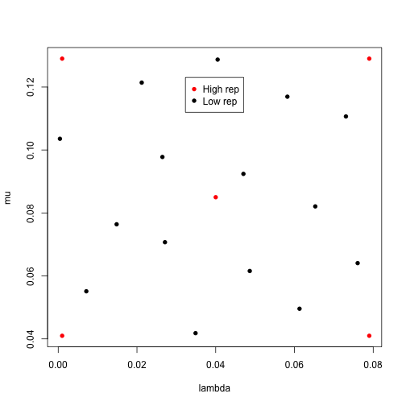

As always, we start by defining parameters, ranges, and targets:


```r
ranges <- list(
  lambda = c(0, 0.08),
  mu = c(0.04, 0.13)
)
targets = list(
  Y = c(90, 110)
)
```

We can train stochastic emulators to this data by passing the whole training dataset, with repetitions, to `variance_emulator_from_data`. This works outwardly in the same fashion as `emulator_from_data`, but the output has a different form. For details about how hierarchical emulators are constructed, see the section at the bottom of this document.


```r
stochastic_em <- variance_emulator_from_data(BirthDeath$training, names(targets), ranges)
#> Separated dataset by unique points...
#> Computed summary statistics...
#> Completed variance emulators. Training mean emulators...
#> Fitting regression surfaces...
#> Building correlation structures...
#> Creating emulators...
stochastic_em
#> $variance
#> $variance$Y
#> Parameters and ranges:  lambda: c(0, 0.08): mu: c(0.04, 0.13) 
#> Specifications: 
#> 	 Basis functions:  (Intercept); lambda; mu 
#> 	 Active variables lambda; mu 
#> 	 Regression Surface Expectation:  114.3972; 110.3366; -89.7199 
#> 	 Regression surface Variance (eigenvalues):  0; 0; 0 
#> Correlation Structure: 
#> Bayes-adjusted emulator - prior specifications listed. 
#> 	 Variance (Representative):  7457.208 
#> 	 Expectation:  0 
#> 	 Correlation type: exp_sq 
#> 	 Hyperparameters:  theta: 0.5654 
#> 	 Nugget term: 0 
#> Mixed covariance:  0 0 0 
#> 
#> 
#> $expectation
#> $expectation$Y
#> Parameters and ranges:  lambda: c(0, 0.08): mu: c(0.04, 0.13) 
#> Specifications: 
#> 	 Basis functions:  (Intercept); lambda; mu; I(lambda^2); I(mu^2); lambda:mu 
#> 	 Active variables lambda; mu 
#> 	 Regression Surface Expectation:  51.1203; 36.0522; -39.4482; 9.2633; 13.3696; -22.5676 
#> 	 Regression surface Variance (eigenvalues):  0; 0; 0; 0; 0; 0 
#> Correlation Structure: 
#> Bayes-adjusted emulator - prior specifications listed. 
#> 	 Variance (Representative):  31.33981 
#> 	 Expectation:  0 
#> 	 Correlation type: exp_sq 
#> 	 Hyperparameters:  theta: 0.5654 
#> 	 Nugget term: 0 
#> Mixed covariance:  0 0 0 0 0 0
```

Here we see that, despite providing one output to emulate, we have obtained two emulators labelled `variance` and `expectation` corresponding to approximations of the variance surface and mean surface respectively. If provided with more than $n$ outputs, the same structure would be present: each of `variance` and `emulator` would contain $n$ emulator objects. The output has superficial similarity to a deterministic emulation were we to simply consider `stochastic_em$expectation`.

Variance emulators share much of the structure with their deterministic equivalents; however, the means by which quantities are calculated differ and we can determine that we (and functions within the package) are dealing with a stochastic emulator by checking its class.


```r
class(stochastic_em$expectation$Y)
#> [1] "Hierarchical" "Emulator"     "R6"
```

Along with the usual "R6" and "Emulator" designations, the stochastic emulator is also labelled as "Hierarchical". This signifies the means by which it has been trained.

Details aside, we can treat these emulators in much the same way as we can with deterministic ones: the plotting functionality and diagnostic checks work as we would expect.


```r
emulator_plot(stochastic_em$expectation$Y)
```

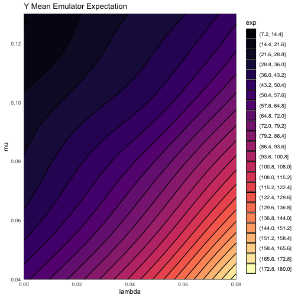

```r
emulator_plot(stochastic_em$variance$Y)
```

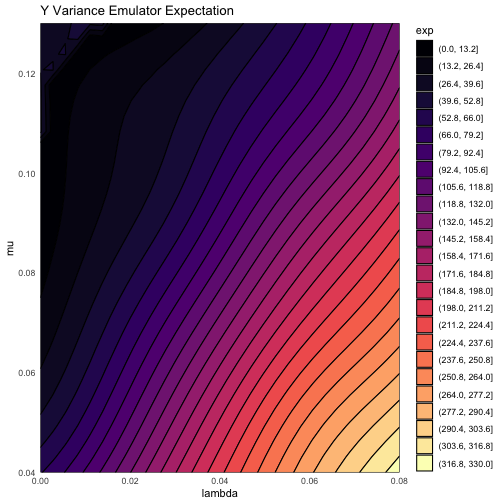

We can see exactly the sort of behaviour we anticipated - the variance increases more or less linearly with increasing birth rate, representing the greater stochasticity when many individuals are present in the model. This feeds into the emulation of the output itself, and while there is little of note in the plot of the mean emulator's expectation, we see something interesting in that of its uncertainty:


```r
emulator_plot(stochastic_em$expectation$Y, 'sd') + geom_point(data = BirthDeath$training, aes(x = lambda, y = mu))
```

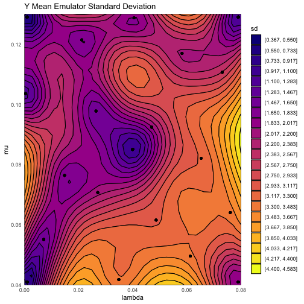

Unlike in the deterministic case, where we stated that the variance at a 'known' point (i.e. one of the points used for training) should be zero, here we see that is not the case. Even at the 'best' points (points used for training that have been determined to be in a low-stochasticity region, such as the top-left) the variance is non-vanishing. The situation is more stark toward the lower-right of the plot, where low-rep points have appreciable uncertainty around them. This is a feature of variance emulation that does not occur if we were to treat this model as in the deterministic cases: by taking into account the changing stochasticity across the input space, we can more accurately provide estimates of uncertainty by emulating this variability. As a result, rather than arbitrarily putting high uncertainty on all points across the space (as would be the case, at best, if we treated this deterministically), the emulators themselves are aware of where the shortcomings are in the data provided and where it can be more certain due to low stochasticity or a high number of runs.

The usual plots still apply: we can of course consider the implausibility across the space:


```r
emulator_plot(stochastic_em$expectation$Y, 'imp', targets = targets)
```

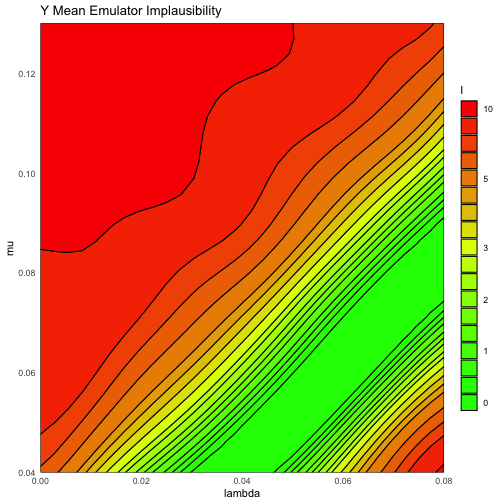

Of interest here is the fact that the very-lowest right section of the space has begun to be deemed unlikely to produce acceptable fits. This would not be the case were it not for the fact that the emulator knows that the value around this region has been 'pinned down' by a high-repetition run.

We may also perform diagnostics on the emulators, for both the mean and variance emulators: we use the validation set provided in `BirthDeath`, though as always in the absence of a validation dataset k-fold cross-validation will be performed.


```r
# Mean emulator: familiar code
mean_em_validation <- validation_diagnostics(stochastic_em$expectation, targets, BirthDeath$validation, plt = TRUE, row = 1)
```

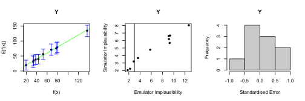

```r
# Variance emulator (no targets; see below)
var_em_validation <- suppressWarnings(validation_diagnostics(stochastic_em$variance, validation = BirthDeath$validation, plt = TRUE, row = 1))
```

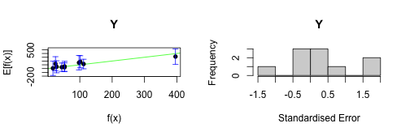

```r
# No targets: LOO cross-validation performed
no_validation <- validation_diagnostics(stochastic_em$expectation, targets, plt = TRUE, row = 1)
```

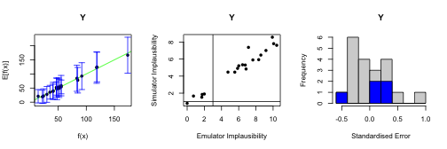

It is worth noting that we do not associate targets to the variance of our output. It is uncommon in scientific fields to wish to match to the stochasticity of outputs as well as their values, occurring only in a few limited situations; nevertheless, were we to include a target we could proceed in the usual fashion.


```r
fake_var_targ <- list(Y = c(30, 50))
var_em_fake_target <- validation_diagnostics(stochastic_em$variance, fake_var_targ, BirthDeath$validation, plt = TRUE, row = 1)
```


Finally, we briefly mention that point generation operates in the same manner as before: in the usual absence of targets for the variance emulator we simply provide `generate_new_runs` with the emulators and the targets for the output.


```r
new_points <- generate_new_runs(stochastic_em, 30, targets, resample = 0)
#> Proposing from LHS...
#> LHS has high yield - no other methods required.
#> Selecting final points using maximin criterion...
plot_wrap(new_points, ranges)
```

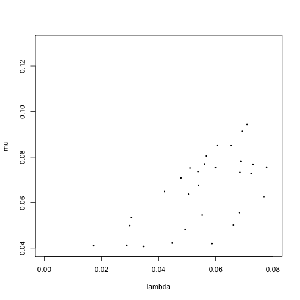

## Bimodality

The previous example displayed the stochastic behaviour we wished to consider, but the simple nature of the model meant that it was a limited demonstration of the issues that can be faced when dealing with stochastic models. One extremely common (and often problematic) feature of stochastic disease models is bimodality: dependent on starting conditions, one can perform multiple repetitions at a given input point and find two distinct classes of behaviour. The most common example of this is 'take off vs die out', where if the initial number of infected people is low the disease might infrequently find its way into the population, but blowing up on those rare circumstances it does. In such a situation, it does not make sense to try to emulate the output as an individual entity, as even at a single point there are two very different situations occuring. Instead, we provide a basic framework to handle bimodality.

We may revisit the 'deterministic' example touched upon before - the SIRS model. In the previous examples, we started the simulation with an adequate number of infected people to avoid bimodality: 5% of the population started out infected. Here we will instead start with 0.5% of the population infected. Even in a simple model such as this, we can still find bimodality.


```r
example_params <- c(0.45, 0.25, 0.025)
model_result <- get_results(example_params, raw = TRUE)
plot(0:60, ylim=c(0,600), ty="n")
for(j in 2:3) for(i in 1:100) lines(0:60, model_result[,j,i], col=(2:4)[j], lwd=0.3, xlab = "Time", ylab = "Number")
legend('topleft', legend = c('Recovered', "Infected"), lty = 1, col = c(4, 3), inset = c(0.05, 0.05))
```

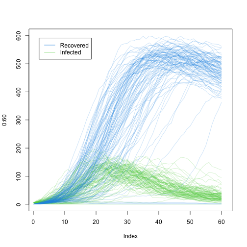

We can clearly see in the R compartment that, even at a single point (the midpoint of the ranges previously considered), there are two distinct modes. One corresponds to the disease failing to take off, in which case both the Infected and Recovered compartments remain (close to) empty; the other is where the disease does take off and the Recovered compartment grows until the eventual die-down of the disease. It is clear that if we were to attempt to emulate the number of recovered people at $t=50$, say, even taking into account the stochasticity we would not emulate either mode - the likelihood is that the emulators would suggest a mid-range value with very large uncertainty, providing no predictive power.

We will emulate six outputs - three from the Infected compartment, and three from the Recovered compartment. The times at which we observe these compartments will be $t=10, 25, 50$, which display varying levels of bimodality. The data we will use is pre-generated using the same code as was used to generate the above plot: we have $30$ points on which to train and $20$ to validate with; each point has had $100$ repetitions. We will also define some targets.


```r
SIR_ranges <- list(
  aSI = c(0.1, 0.8),
  aIR = c(0, 0.5),
  aSR = c(0, 0.05)
)
training <- SIR_stochastic$training
validation <- SIR_stochastic$validation
bim_targets <- list(
  I10 = list(val = 35, sigma = 3.5),
  I25 = list(val = 147, sigma = 14.7),
  I50 = list(val = 55, sigma = 5.5),
  R10 = list(val = 29, sigma = 2.9),
  R25 = list(val = 276, sigma = 27.6),
  R50 = list(val = 579, sigma = 57.9)
)
```

The data has a similar form to that of the variance emulation discussed above, and a cursory glance would not be sufficient to decide whether bimodality is present. In principle, any data containing replicates can be treated as bimodal, but it is possible that the computational cost of emulating multiple modes (where they exist) are unnecessary where the data is in fact unimodal (or extremely close to unimodal). Judgement should be used as to whether this more involved approach to emulation is warranted.

In any event, if we feel that the model exhibits strong bimodality, we may use the (imaginatively titled) `bimodal_emulator_from_data`. The usage follows the standard behaviour of the `emulator_from_data` family.


```r
bim_ems <- bimodal_emulator_from_data(training, names(bim_targets), SIR_ranges)
#> Separated dataset by unique points.
#> Training emulator to proportion in modes.
#> Performing clustering to identify modes.
#> No targets appear to be unimodal.
#> Training to bimodal targets.
#> Trained emulators. Collating.
names(bim_ems)
#> [1] "mode1" "mode2" "prop"
```

The structure of the output is different again to the output of either of the previous emulator building functions. We obtain a list of three objects: `mode1`, `mode2`, and `prop`. Modes 1 and 2 represent the two modes identified and trained to, and inside each is a set of emulators to emulate both the mean surface and the variance surface (akin to the output of `variance_emulator_from_data`). The `prop` object is a single, deterministic, emulator that is trained to the proportion of repetitions that reside in each mode. This can be instructive when considering which points to propose at later waves: for example, given two points with implausibilities deemed to be $I=2.5$ and $I=2.75$ respectively, we may favour the latter point if our `prop` emulator suggests that a higher proportion of repetitions reside in the mode that we are interested in.

We can quickly see the difference in the modes by simply plotting the expectation of a time point within each mode:


```r
emulator_plot(bim_ems$mode1$expectation$R50)
```

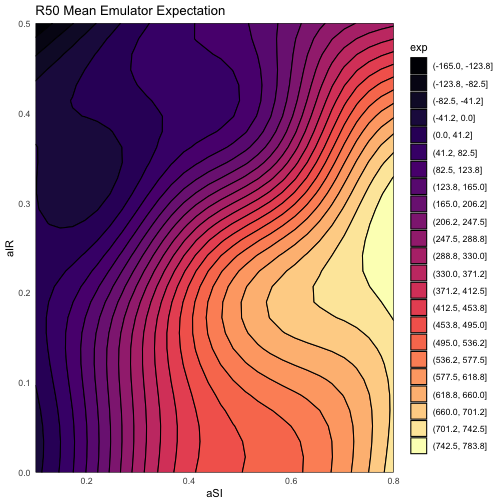

```r
emulator_plot(bim_ems$mode2$expectation$R50)
```

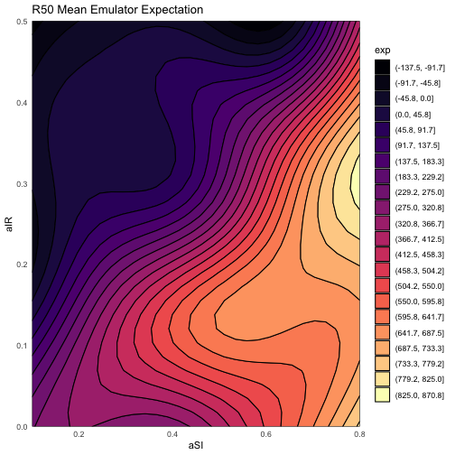

We can validate in the same fashion as always, using the validation set generated. The output bears strong similarity to previous plots, but for one subtlety.


```r
bim_invalid <- validation_diagnostics(bim_ems, bim_targets, validation)
```

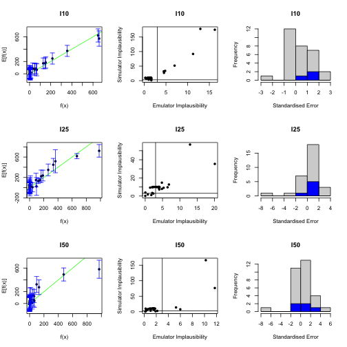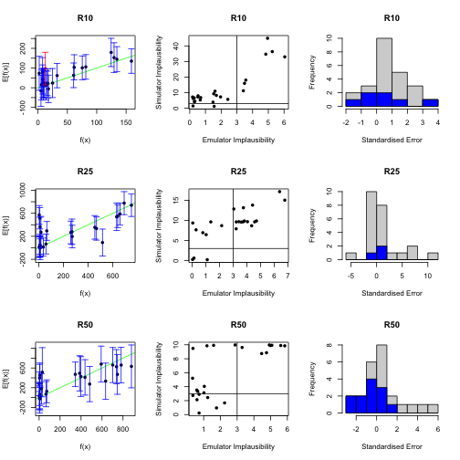

Close inspection reveals that, despite providing $20$ validation points to the emulators, some of the plots have over $20$ distinguishable points in them. This is no accident: when validating we test against both modes of emulators, which results in an approximate doubling of points (it is only approximate as it is possible that one parameter set contributes solely to one mode, so the other mode would not need to be validated against that point). We can also see, particularly in the output for R50, the nature of the bimodality: in the comparison plot we can see a cluster of results near $0$, a gap between $200$ and $\sim400$, and then another set of results beyond that.

We can also consider implausibility for the emulators. The usual plotting functions (expectation, variance, standard deviation) work in the same manner as for non-bimodal emulators, with the caveat that one must specify which mode we wish to plot:


```r
emulator_plot(bim_ems$mode1)
```

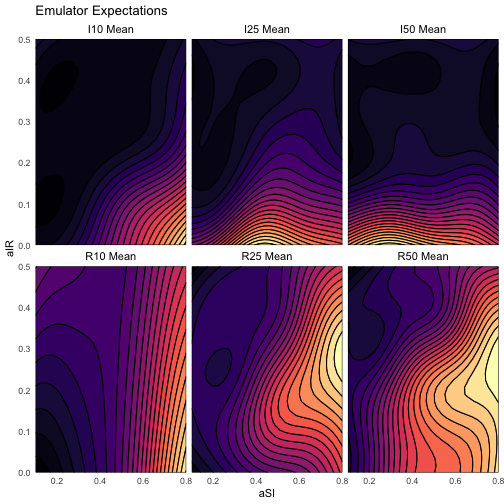

```r
emulator_plot(bim_ems$mode2)
```

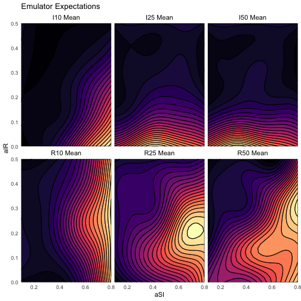

The 'nimp' option to `emulator_plot` works slightly differently, due to how nth implausibilities are calculated with multiple modes. Since we would regard a point as non-implausible for a given target if it is valid with respect to either mode, the `nth_implausible` function calculates mode-wise minimum implausibility for each output, then checks the nth maximum over this collection. Correspondingly, the 'nimp' option takes the full set of emulators.


```r
emulator_plot(bim_ems, 'nimp', targets = bim_targets)
```

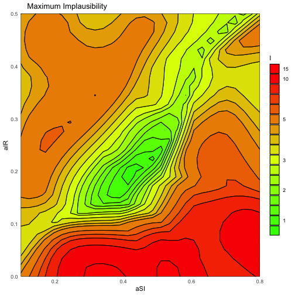

By comparing with the individual nth-implausibility plots for each mode, we can see that regions of parameter space that would otherwise be dismissed are retained.


```r
emulator_plot(bim_ems$mode1, 'nimp', targets = bim_targets)
```

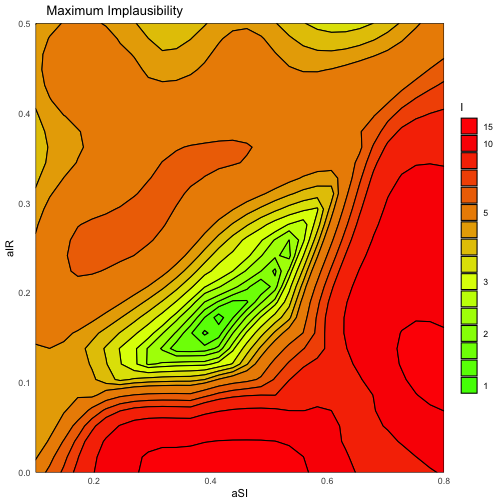

```r
emulator_plot(bim_ems$mode2, 'nimp', targets = bim_targets)
```

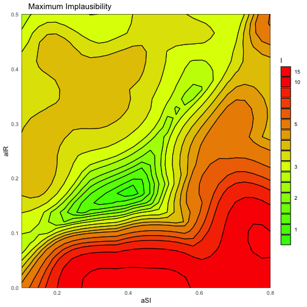

Finally, generating new points from bimodal emulators has an identical form to in any other circumstance, via the `generate_new_runs` function.


```r
new_points <- generate_new_runs(bim_ems, 100, bim_targets, resample = 0)
#> Proposing from LHS...
#> LHS has high yield - no other methods required.
#> Selecting final points using maximin criterion...
plot_wrap(new_points, SIR_ranges)
```

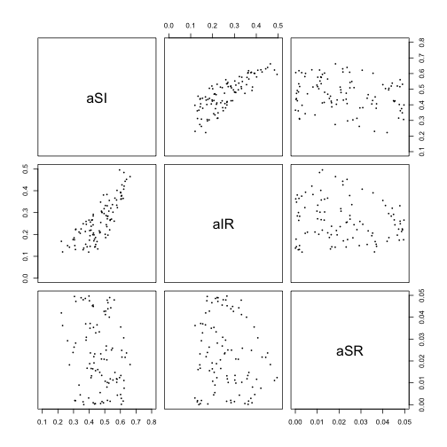

## Appendix: Training Hierarchical Emulators

When emulating stochastic systems, we wish to have an adequate understanding of the change in variance across the space as a consequence of the stochasticity. There are a multitude of ways to address this issue:

- The most straightforward (and conservative) would be to treat the stochasticity as a flat overall additional source of uncertainty at any point in the input space. We could train 'vanilla' emulators to the data and include this extra uncertainty as an external factor: this would be tantamount to modifying the `em$disc` quantities in the Emulator object. If well-chosen, this safeguards against incorrectly ruling out regions of parameter space, but lacks nuance.

- We could represent the variance in the parameter space $x = (x_1, x_2, \dots, x_p)$ by some function $s(x)$, and use this as a prior for the variance $\sigma^2$ in the correlation structure of the emulator. The procedure would be identical to normal cases, except for the fact that the prior (and Bayes Linear adjusted) $\sigma^2$ is now functional rather than constant. This is a powerful approach provided we know, or have a very strong belief about, the 'true' variance across the space.

- If we do not wish to add a blanket inflationary factor to the variance, and do not believe that we can accurately make judgments about a functional form for it (for example, if we do not have sufficient points from the space or repetitions therein to clearly identify the nature of the heteroskedasticity), then we may instead emulate the variance, taking into account the fact that we have an incomplete picture available to us. This latter approach is the one we demonstrate here.

Suppose we have parameter sets $[x_1, x_2, \dots, x_k]$, which when applied to the model give realisations $[y_{11}, y_{12}, \dots, y_{1n_1}, y_{21}, \dots, y_{kn_k}]$. Here $y_{ab}$ is the $b^{th}$ realisation of the model applied to the point $x_a$, $f(x_a)$. We need not have the same number of repetitions at each input point; we therefore index the number of repetitions by $n_1, n_2, \dots, n_k$. From each collection of repetitions identified by input point $x_i$, we can obtain a sample estimate of the mean at this point and the variance. For sufficiently high-repetition points, we may even be able to make a sensible guess at the higher order quantities at that point; for example, the kurtosis.

The way in which this information, taking into account the sampled nature of it, is as follows. We split the data into 'high-rep' points and 'other' points, and use the information from the high-rep points to generate a prior structure for the variance surface. The prior structure takes the normal form, namely a regression surface (which here represents the change in variance across the space, rather than the output as is normal for us) and a correlation structure which relates to the variance-of-the-variance. Given this, we can perform a modified Bayes Linear update using all variance data available to us (including from the other points) that takes into account the fact that we are dealing with a sample variance. This gives, for each output, an emulator whose predicted value is the variance at the point.

We could do exactly the same to emulate the mean, but we already have a representation of the variance of the outputs *that formally quantifies the uncertainties around the variance*. We can therefore use the variance emulator to help provide a prior for the mean emulator - this acts as a sample-adjusted stand-in for an exact functional representation of the variance mentioned in option 2 above. The regression surface we take in the usual fashion, from the output means. Allowing for the fact that the means, too, are sample means, we perform the modified Bayes Linear adjustment as in the variance emulator case.

This framework allows us to make reasoned judgments about the nature of the heteroskedasticity in this stochastic system, while accounting for our uncertainties about that structure, without resorting to a blanket inflation of the emulator uncertainties. This general approach, which we term Hierarchical Emulation, can be used in a multitude of contexts rather than just variance emulation. For example, the framework can be applied to perform cross-model emulation, using the results of a fast model as a prior for a slower, more accurate, one.
